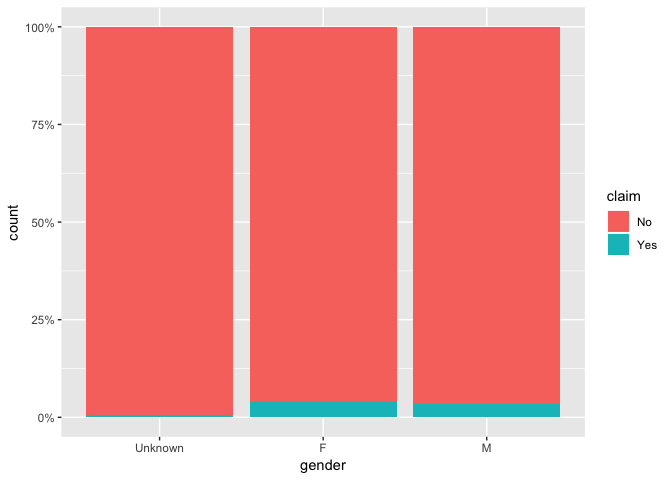
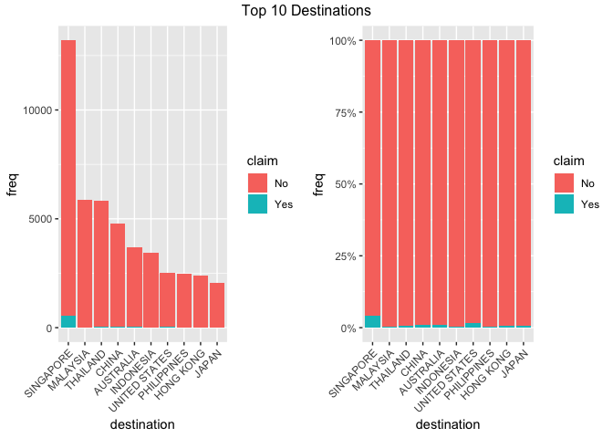
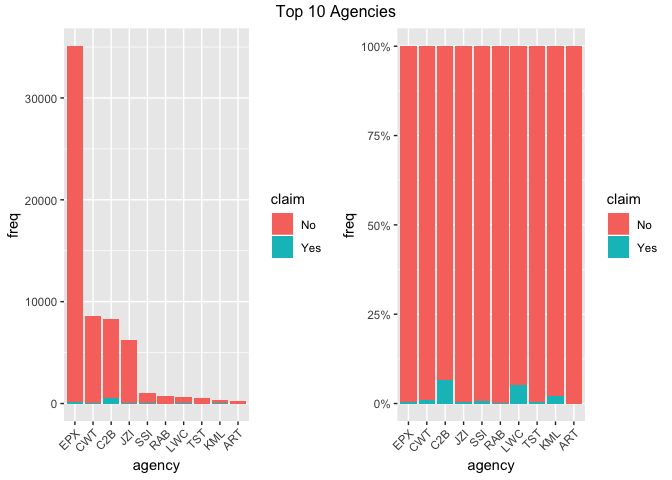
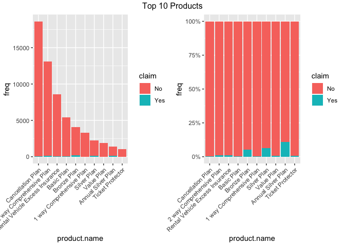

Analyzing Travel Insurance
================
Kah Jun Lim
10/2/2019

# Introduction

The purpose of this project is to perform exploratory data analysis(EDA)
on travel insurance dataset and identify factors that might affect
whether a claim is made.

# Loading the Data and Dependencies

``` r
library(dplyr)
library(ggplot2)
library(tidyr)
library(forcats)
library(scales)
library(gridExtra)
library(caret)
library(rpart)
library(rpart.plot)
library(pROC)
library(randomForest)
library(xgboost)
set.seed(0)

travel_insurance_full <- read.csv("data/travel_insurance.csv")
head(travel_insurance_full)
```

    ##   Agency   Agency.Type Distribution.Channel
    ## 1    CBH Travel Agency              Offline
    ## 2    CBH Travel Agency              Offline
    ## 3    CWT Travel Agency               Online
    ## 4    CWT Travel Agency               Online
    ## 5    CWT Travel Agency               Online
    ## 6    JZI      Airlines               Online
    ##                      Product.Name Claim Duration   Destination Net.Sales
    ## 1              Comprehensive Plan    No      186      MALAYSIA     -29.0
    ## 2              Comprehensive Plan    No      186      MALAYSIA     -29.0
    ## 3 Rental Vehicle Excess Insurance    No       65     AUSTRALIA     -49.5
    ## 4 Rental Vehicle Excess Insurance    No       60     AUSTRALIA     -39.6
    ## 5 Rental Vehicle Excess Insurance    No       79         ITALY     -19.8
    ## 6                      Value Plan    No       66 UNITED STATES    -121.0
    ##   Commision..in.value. Gender Age
    ## 1                 9.57      F  81
    ## 2                 9.57      F  71
    ## 3                29.70         32
    ## 4                23.76         32
    ## 5                11.88         41
    ## 6                42.35      F  44

``` r
colnames(travel_insurance_full) <- c("agency", "agency.type", "distribution.channel", "product.name", "claim", 
                                     "duration", "destination", "net.sales", "commision", "gender", "age")
```

# Exploratory Data Analysis

## Handling Missing/Bad Data

``` r
summary(travel_insurance_full)
```

    ##      agency             agency.type    distribution.channel
    ##  EPX    :35119   Airlines     :17457   Offline: 1107       
    ##  CWT    : 8580   Travel Agency:45869   Online :62219       
    ##  C2B    : 8267                                             
    ##  JZI    : 6329                                             
    ##  SSI    : 1056                                             
    ##  JWT    :  749                                             
    ##  (Other): 3226                                             
    ##                           product.name   claim          duration      
    ##  Cancellation Plan              :18630   No :62399   Min.   :  -2.00  
    ##  2 way Comprehensive Plan       :13158   Yes:  927   1st Qu.:   9.00  
    ##  Rental Vehicle Excess Insurance: 8580               Median :  22.00  
    ##  Basic Plan                     : 5469               Mean   :  49.32  
    ##  Bronze Plan                    : 4049               3rd Qu.:  53.00  
    ##  1 way Comprehensive Plan       : 3331               Max.   :4881.00  
    ##  (Other)                        :10109                                
    ##     destination      net.sales         commision      gender   
    ##  SINGAPORE:13255   Min.   :-389.00   Min.   :  0.00    :45107  
    ##  MALAYSIA : 5930   1st Qu.:  18.00   1st Qu.:  0.00   F: 8872  
    ##  THAILAND : 5894   Median :  26.53   Median :  0.00   M: 9347  
    ##  CHINA    : 4796   Mean   :  40.70   Mean   :  9.81            
    ##  AUSTRALIA: 3694   3rd Qu.:  48.00   3rd Qu.: 11.55            
    ##  INDONESIA: 3452   Max.   : 810.00   Max.   :283.50            
    ##  (Other)  :26305                                               
    ##       age        
    ##  Min.   :  0.00  
    ##  1st Qu.: 35.00  
    ##  Median : 36.00  
    ##  Mean   : 39.97  
    ##  3rd Qu.: 43.00  
    ##  Max.   :118.00  
    ## 

There are 10 features in this data set, 4 of them are numeric and the
others are factors. The only column with missing data is Gender, where a
large portion of the values are missing. I notice that there are
non-positive values for duration, which does not make sense. There are
also durations that are excessively long. For age, the highest value is
118.

``` r
travel_insurance_full %>%
  filter(duration <= 0 | duration >= 1000) %>%
  nrow
```

    ## [1] 80

``` r
travel_insurance_full %>%
  filter(age > 100) %>%
  nrow
```

    ## [1] 984

Since there is only a relatively small proportion of the data contains
unreasonable duration and uncommon age, I remove these data points for
the purpose of this project. To reduce the levels of destination, I also
group the countries with less than 50 observations as Others.

``` r
travel_insurance <- travel_insurance_full %>%
  filter(duration > 0 & duration < 1000 & age <= 100) %>%
  group_by(destination) %>%
  mutate(freq = n()) %>%
  ungroup() %>%
  mutate(destination = ifelse(freq > 50, as.character(destination), "OTHERS")) %>%
  transform(destination = as.factor(destination))
```

    ## Warning: The `printer` argument is deprecated as of rlang 0.3.0.
    ## This warning is displayed once per session.

``` r
levels(travel_insurance$gender) <- c("Unknown", "F", "M")
```

We can now move on to look at distribution of some of the features.

## Looking Into Factor Variables

### Claim

``` r
ggplot(travel_insurance, aes(x = claim)) +
  geom_bar()
```

<!-- -->

From the graph above, we see that only an extremely small number of
policies have claims, which is what one would expect. In this case,
claims occured can be viewed as anomalies or rare events. Moving
forward, it is better to look at the proportion instead of the
frequencies.

### Agency Type

``` r
ggplot(travel_insurance, aes(x = agency.type, fill = claim)) +
  geom_bar(position = "fill") +
  scale_y_continuous(labels = percent_format())
```

<!-- -->

We see that policies sold by airlines are more likely to observe claim
compared to policies sold via travel agencies.

### Gender

``` r
ggplot(travel_insurance, aes(x = gender, fill = claim)) +
  geom_bar(position = "fill") +
  scale_y_continuous(labels = percent_format())
```

<!-- -->

It is interesting that Unknown gender experienced less claims than M or
F. One possible explanation is that the higher the chance of claims, the
more formal the policy would be, which includes recording more
information of the
policyholder.

### Destination

``` r
plot_top_n(travel_insurance, "destination", n = 10, title = "Top 10 Destinations")
```

<!-- -->

In this dataset, the country with the most entry is Singapore, which
also has the highest proportion of claims observed. Among the top 10
countries in this data, US, China, and Australia also have relatively
higher proportion of claims compared to the others.

### Agency

``` r
plot_top_n(travel_insurance, "agency", title = "Top 10 Agencies")
```

<!-- -->

The agencies with high proportion of claims observed are C2B and LWC.

### Product

``` r
plot_top_n(travel_insurance, "product.name", title = "Top 10 Products")
```

<!-- -->

Among the top 10 products in this data, Annual Silver Plan, Silver Plan,
and Brownze Plan has the highest claims proportions.

## Numeric Variables

``` r
p1 <- ggplot(travel_insurance, aes(x = duration, y = claim)) +
  geom_point(alpha = 0.05, shape = 1)
p2 <- ggplot(travel_insurance, aes(x = net.sales, y = claim)) +
  geom_point(alpha = 0.05, shape = 1)
p3 <- ggplot(travel_insurance, aes(x = commision, y = claim)) +
  geom_point(alpha = 0.05, shape = 1)
p4 <- ggplot(travel_insurance, aes(x = age, y = claim)) +
  geom_point(alpha = 0.05, shape = 1)
grid.arrange(p1, p2, p3, p4, ncol = 2)
```

<!-- -->

There doesn’t seem to be any obvious pattern in the four plots.
Nevertheless, the interaction between these features with each other or
the factor variables might become useful.

# Building Models

## Train-Test Splitting

Before we begin building models, we want to split the data into training
set and testing
set.

``` r
train.index <- createDataPartition(travel_insurance$claim, p = 0.7, list = FALSE)
train <- travel_insurance[train.index,]
test <- travel_insurance[-train.index,]
show_prop(travel_insurance)
```

    ## # A tibble: 2 x 3
    ##   claim     n   prop
    ##   <fct> <int>  <dbl>
    ## 1 No    61374 0.985 
    ## 2 Yes     917 0.0147

``` r
show_prop(train)
```

    ## # A tibble: 2 x 3
    ##   claim     n   prop
    ##   <fct> <int>  <dbl>
    ## 1 No    42962 0.985 
    ## 2 Yes     642 0.0147

``` r
show_prop(test)
```

    ## # A tibble: 2 x 3
    ##   claim     n   prop
    ##   <fct> <int>  <dbl>
    ## 1 No    18412 0.985 
    ## 2 Yes     275 0.0147

## Tree-Based Models

### Simple Decision Trees

``` r
tree.simple <- rpart(claim ~ ., train)
```

Since the data is very imbalanced, our simple model would always
classify policy as no claim. The model achieved a high accuracy of
98.5%, implying accuracy is a bad metric for performance. Dealing with
imbalanced data, we can do the following two things:

1.  oversample the minority data to generate a balanced sample

2.  use F1-score as our metric as it considers both precision and recall

<!-- end list -->

``` r
evaluate_tree(tree.simple, test)
```

    ##           Reference
    ## Prediction    No   Yes
    ##        No  18412   275
    ##        Yes     0     0

    ##  Accuracy Precision       TPR        F1 
    ## 0.9852839        NA 0.0000000        NA

Since all the prediction are negative, none of the true positive are
correctly predicted. As a results, the true positive rate is 0.

### Simple Decision Tree on Resampled Balanced Data

``` r
train.balanced <- draw_balanced_sample(train, 10000)
show_prop(train.balanced)
```

    ## # A tibble: 2 x 3
    ##   claim     n  prop
    ##   <fct> <int> <dbl>
    ## 1 No    10000   0.5
    ## 2 Yes   10000   0.5

``` r
tree.simple.balanced <- rpart(claim ~ ., train.balanced)
evaluate_tree(tree.simple.balanced, test)
```

    ##           Reference
    ## Prediction    No   Yes
    ##        No  13634    55
    ##        Yes  4778   220

    ##   Accuracy  Precision        TPR         F1 
    ## 0.74137101 0.04401761 0.80000000 0.08344396

Although the accuracy drops, we see that the model is now predicting
some of the true positive correctly. The problem now is that the model
is also predicting a lot of the true negative as positive. Overall, the
F1-score is pretty low. This is due to overfitting, and to tackle this
problem, we can try using some ensemble methods like bagging and
boosting.

### Random Forest Model

``` r
set.seed(0)
rf.balanced <- randomForest(claim ~ ., train, ntree = 300,
                            sampsize = c(500, 200),
                            strata = train$claim)
rf.balanced
```

    ## 
    ## Call:
    ##  randomForest(formula = claim ~ ., data = train, ntree = 300,      sampsize = c(500, 200), strata = train$claim) 
    ##                Type of random forest: classification
    ##                      Number of trees: 300
    ## No. of variables tried at each split: 3
    ## 
    ##         OOB estimate of  error rate: 12.14%
    ## Confusion matrix:
    ##        No  Yes class.error
    ## No  37946 5016   0.1167543
    ## Yes   276  366   0.4299065

``` r
evaluate_tree(rf.balanced, test, rf = TRUE)
```

    ##           Reference
    ## Prediction    No   Yes
    ##        No  16372   113
    ##        Yes  2040   162

    ##   Accuracy  Precision        TPR         F1 
    ## 0.88478622 0.07356948 0.58909091 0.13080339
